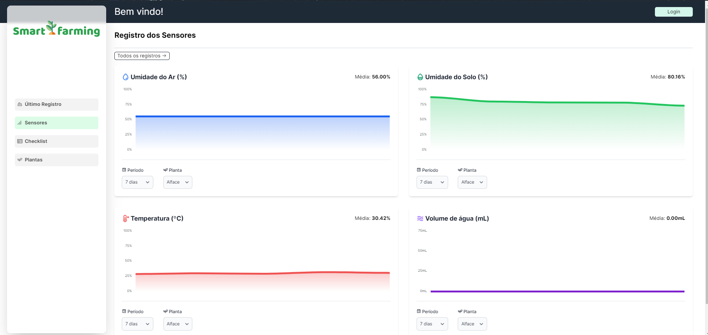
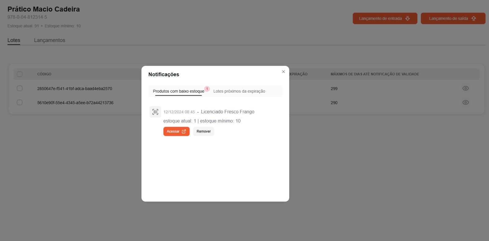

# Portfólio Fatec - João Pedro Carvalho dos Santos

Este portfólio apresenta projetos desenvolvidos em grupo, aplicando a [Metodologia Scrum](https://www.scrum.org/resources/what-scrum-module) na Fatec - São José dos Campos. Nossos clientes foram tanto empresas parceiras quanto professores internos, proporcionando uma experiência prática e alinhada às demandas do mercado.

## Sumário

* [**Sobre Mim**](#sobre-mim)
    * [Meus Conhecimentos](#sobre-mim)
    * [Contatos](#sobre-mim)
* [**Meus Projetos**](#projetos)
    * [**1º Semestre (1/2024) - Smart Farming**](#smart-farming)
        * [Principais Funcionalidades](#principais-funcionalidades)
        * [Tecnologias Utilizadas](#tecnologias-utilizadas)
        * [Contribuições Pessoais](#contribuições-pessoais)
        * [Lições Aprendidas](#lições-aprendidas)
        * [Hard Skills Desenvolvidas](#hard-skills-desenvolvidas)
        * [Soft Skills Desenvolvidas](#soft-skills-desenvolvidas)
    * [**1º Semestre (2/2024) - Stocker**](#stocker)
        * [Principais Funcionalidades](#principais-funcionalidades-1)
        * [Tecnologias Utilizadas](#tecnologias-utilizadas-1)
        * [Contribuições Pessoais](#contribuições-pessoais-1)
        * [Lições Aprendidas](#lições-aprendidas-1)
        * [Hard Skills Desenvolvidas](#hard-skills-desenvolvidas-1)
        * [Soft Skills Desenvolvidas](#soft-skills-desenvolvidas-1)
    * [**3º Semestre (1/2025) - Chronos**](#chronos)
        * [Principais Funcionalidades](#principais-funcionalidades-2)
        * [Tecnologias Utilizadas](#tecnologias-utilizadas-2)
        * [Contribuições Pessoais](#contribuições-pessoais-2)
        * [Lições Aprendidas](#lições-aprendidas-2)
        * [Hard Skills Desenvolvidas](#hard-skills-desenvolvidas-2)
        * [Soft Skills Desenvolvidas](#soft-skills-desenvolvidas-2)

## Sobre mim

Técnico em Desenvolvimento de Sistemas na Etec - Professora Ilza Nascimento Pintus, graduando em Desenvolvimento de Software Multiplataforma na FATEC São José dos Campos e atualmente desenvolvedor Full Stack estagiário pela [Design Líquido](https://www.designliquido.com.br/).

Ao longo de dois anos de experiência profissional em desenvolvimento web e mobile, incluindo minha atuação como freelancer, desenvolvi e otimizei diversas soluções. Dentre elas, destaco a criação de um [blog de notícias](https://github.com/JohnPetros/pulo-do-gato-news) e um sistema de e-commerce completo [(site e aplicativo mobile)](https://github.com/JohnPetros/sertton). Nessas experiências, aprofundei meu conhecimento em aplicar conceitos técnicos com foco em SEO, UX e na implantação de sistemas em produção, além de explorar o desenvolvimento serverless.

Além disso, sou um entusiasta e colaborador ativo em projetos open source. Destaco minha participação no [Delégua](https://www.designliquido.com.br), uma linguagem de programação 100% em português baseada em TypeScript. Inclusive, utilizei o Delégua no meu TCC da ETEC, a plataforma [StarDust](https://github.com/JohnPetros/stardust), desenvolvida para o ensino de lógica de programação para iniciantes.

Estou sempre em busca de novos desafios que me permitam aplicar e expandir minhas habilidades em todo o stack de desenvolvimento, contribuindo para projetos inovadores e de impacto.

- [LinkedIn](https://www.linkedin.com/in/jo%C3%A3o-pedro-carvalho-dos-santos-42a0ab222/)
- [Github](https://github.com/JohnPetros)
- [Gmail](joaopcarvalho.cds@gmail.com)

## Projetos

### Smart Farming

  

1º Semestre - 1/2024

Cliente: [Alfred Makoto Kabayama - Professor da Fatec](https://www.linkedin.com/in/alfred-makoto-kabayama-0aa93757/)

O Smart Farming é uma aplicação web desenvolvida para auxiliar o monitoramento de estufa inteligente mantida pela Fatec de São José dos Campos. Seu objetivo é simplificar a gestão, fornecendo ferramentas para a coleta e visualização de dados de sensores (como temperatura, umidade e pH), a execução de check-lists de manutenção, a geração de relatórios detalhados e o controle de acesso administrativo. Isso permite uma gestão mais eficiente e automatizada do ambiente agrícola controlado.

### Principais funcionalidades

O aplicativo foi estruturado em três funcionalidades principais para atender aos objetivos propostos: 
- Gerenciamento de Sensores
- Checklist 
- Plantas

##### Gerenciamento de Sensores

A seção de Gerenciamento de Sensores oferece ao usuário controle total sobre os dados. É possível visualizar, editar e deletar informações captadas automaticamente pelos sensores ou inseri-las manualmente. Há também a opção de importar dados via arquivo CSV. Para uma análise aprofundada, os dados de umidade do ar (%), umidade do solo (%), temperatura (°C) e volume de água (mL) podem ser visualizados em um dashboard interativo contendo quatro gráficos.

###### Gerenciamento de Checklist

No Gerenciamento de Checklist, o usuário tem a flexibilidade de registrar novos dados através de um formulário interno, bem como editar, deletar e importar informações via arquivo CSV. Todos os registros podem ser facilmente visualizados em uma tabela paginada, facilitando a navegação e a consulta.

##### Gerenciamento de Plantas

Por fim, no Gerenciamento de Plantas, o usuário pode administrar todas as plantas da estufa. É possível criar novos registros, editá-los, desativá-los quando necessário e visualizar a lista completa de plantas cadastradas.

###### Página que exibe o último dado coletado pelos sensores

###### Página de gráficos referente aos sensores

###### Página de gráficos referente a dados de checklist

###### Página de exibição de dados coletados pelos sensores

###### Formulário de registro coletado pelos sensores de forma manual

### Tecnologias utilizadas

- [Flask](https://flask.palletsprojects.com/en/stable/): Framework escolhido para o desenvolvimento do servidor da aplicação (backend).
- [Docker](https://www.docker.com/): Essencial para a conteinerização do servidor e do banco de dados, facilitando a gestão do ambiente e a implantação.
HTML: Utilizado na estruturação dos templates da interface web.
- [JavaScript](https://developer.mozilla.org/pt-BR/docs/Web/JavaScript): Empregado para adicionar interatividade e dinamismo à interface web.
- [ApexCharts](https://apexcharts.com/): Biblioteca implementada para a criação dos gráficos interativos presentes no dashboard.
- [Figma](https://www.figma.com/pt-br/): Ferramenta utilizada para o desenvolvimento e a prototipagem das wireframes do projeto.

### Contribuições pessoais

Como Product Owner no projeto SmartFarming, atuei como o elo entre o time de desenvolvimento e o cliente, desempenhando uma série de responsabilidades-chave, como:

- Visão do produto e estratégia: precisei ter uma compreensão clara do que o produto deve ser, qual problema ele resolve, para quem ele é e qual valor ele trará para o negócio e para os usuários, articulando essa visão para toda a equipe. Defini um roadmap é um plano estratégico de alto nível que descreve a direção e as metas do produto ao longo do tempo, incluindo os principais marcos e funcionalidades a serem entregues.

- Gerenciamento do backlog do produto: O backlog é uma lista priorizada de todas as funcionalidades, melhorias, correções de bugs e outras tarefas que precisam ser feitas no produto. Fiquei responsável por detalhar esses itens, garantindo que sejam claros, compreensíveis e que agreguem valor.

- Colaboração com o time de desenvolvimento: precisei estar acessível para responder a perguntas, fornecer esclarecimentos sobre os requisitos e ajudar o time a entender o propósito de cada item do backlog. Também, inspecionei o trabalho concluído em cada sprint para garantir que os requisitos foram atendidos e que o produto está evoluindo na direção certa.

Além disso, por ter maior experiência de desenvolvimento na equipe fui responsável pela lideranaça técnica do projeto, desempenhando as tarefas: 

- Projetar a estrutura do sistema, escolher as tecnologias, frameworks e ferramentas mais adequadas para o projeto, garantindo que as decisões técnicas estejam alinhadas com os objetivos de negócio e as melhores práticas da indústria.
- Realizar revisões de código (code reviews) para assegurar que os padrões de qualidade sejam seguidos, identificar problemas, promover boas práticas de desenvolvimento e incentivar a consistência do código.
- Resolver desafios técnicos mais complexos, podendo destacar a integração entre o sistema web desenvolvido por nós e uma placa ESP32 para a tranferência contínua e automática de dados entre a estufa inteligente e a nossa aplicação, sendo este o maior desafio do projeto.

### Lições Aprendidas

Neste semestre, aprendi duas lições cruciais: a primeira é que trabalhar em equipe com boa organização é muito mais eficaz do que tentar resolver tudo sozinho, pois a combinação de ideias e experiências diversas não só acelera a resolução de problemas, mas também gera soluções mais eficientes e inovadoras; a segunda é que ensinar outras pessoas solidifica e torna o próprio aprendizado muito mais eficiente, reforçando o conhecimento e revelando lacunas.

### Hard Skills Desenvolvidas

Este semestre pude finalmente aplicar, de forma profissional, Python na construção de um sistema web monolítico. Consegui consolidar meus conhecimentos sobre separação de responsabilidades, um conceito arquitetural básico que me ajudou a criar um código mais limpo e fácil de manter.
Aprendi que a containerização com Docker é uma ferramenta essencial para mim, pois garante que o ambiente de desenvolvimento seja eficiente e independentes das configurações de máquina. 
Além disso, explorei ferramentas de infraestrutura da AWS, como o EC2 (Elastic Compute Cloud), que me permitiu provisionar e gerenciar máquinas virtuais na nuvem para hospedar a aplicação, e o RDS (Relational Database Service), que simplificou a configuração e manutenção do banco de dados relacional, automatizando tarefas como backups. Dessa forma, aprendi a construir um ambiente de produção robusto para uma aplicação web em Python e com load balancer, usando Gunicorn e Nginx. 
Para completar, tive a oportunidade de usar HTMX e HyperScript, ferramentas muito pouco conhecidas no mercado, para criar atualizações rápidas em páginas HTML estáticas, sem a complexidade de grandes frameworks JavaScript. 

### Soft Skills Desenvolvidas

Antes eu possuía muita dificuldade em trabalhar em equipe, pois eu, tendo comumente mais experiência que os demais, preferia fazer a maior parte, somente do meu jeito e sem deixar os outros colaborarem, por achar que não poderiam fazer da mesma forma que eu. Porém, aprendi que isso é totalmente errado, pois é melhor ter uma equipe engajada e capacitada, onde todos contribuem com suas perspectivas e habilidades, do que uma única pessoa sobrecarregada e com uma visão limitada, que impede o crescimento coletivo e a inovação do projeto. Portanto, a partir desse semestre procurei ativamente em ouvir mais as pessoas, deixar que elas expressassem suas ideias, delegar responsabilidades e, principalmente, confiar no potencial de cada um para buscar soluções e aprender com os próprios desafios. Percebi que o resultado final não só se tornou mais rico e diversificado, mas o ambiente de trabalho ficou muito mais colaborativo e produtivo para todos.
Além disso, melhorei minha habilidade de comunicação principalmente no tocante a apresentar ideias e convencer pessoas. Aprendi a estruturar meus argumentos de forma mais lógica, a antecipar objeções e a adaptar minha mensagem ao público, o que me permitiu influenciar decisões e garantir que minhas propostas fossem não só compreendidas, mas também aceitas e implementadas com sucesso.

---

### Stocker

  

 

1º Semestre - 2/2024

Cliente: [Claúdio Etevino de Lima - Professor da Fatec](https://www.linkedin.com/in/claudio-lima-86175522/)

O Stocker é uma aplicação web moderna, projetada para revolucionar o gerenciamento de estoque. Ele oferece funcionalidades completas para o controle de produtos, permitindo a adição, edição e remoção de itens com facilidade. Com o Stocker, você obtém visualização e acompanhamento em tempo real das quantidades e detalhes do seu inventário, substituindo métodos manuais por uma solução tecnológica altamente eficiente. Sua interface intuitiva possibilita o monitoramento do estoque em qualquer tipo de negócio, otimizando a gestão de reposição e capacitando decisões estratégicas mais assertivas.

### Principais funcionalidades

O Stocker oferece uma solução completa para automatização do controle de estoque, controle de permissões, relatório de analytics e assistente de inteligência artificial

#### Controle de Estoque

O Controle de Estoque do Stocker oferece uma visão completa e em tempo real do seu inventário. Com ele, você pode adicionar, editar e remover produtos, além de monitorar quantidades e detalhes de cada produto em lotes. Essa funcionalidade simplifica a gestão de reposição, ajuda a evitar faltas ou excessos e otimiza a tomada de decisões estratégicas para o negócio da empresa.

###### Página de gerenciamento de produtos

###### Página de Gerenciamento de estoque em lote

###### Aba de notifcações de estoque baixo ou lotes próximos da data da validade

##### Controle de Permissões de usuário 

O Controle de Permissões do Stocker permite que o usuário defina exatamente quem pode acessar o quê dentro da plataforma. Com ele, o usuário configura diferentes níveis de acesso para seus colaboradores, garantindo que cada um veja e manipule apenas as informações e funcionalidades relevantes para suas tarefas. Isso aumenta a segurança dos dados e a eficiência operacional, evitando acessos indevidos e simplificando a gestão da equipe.

###### Página de controle de permissões

##### Relatório de Analytics

O Relatório de Analytics do Stocker oferece uma visão aprofundada do desempenho do seu negócio. Com ele, você acessa dados e métricas essenciais apresentados de forma clara e intuitiva, permitindo que você identifique tendências, avalie resultados e tome decisões estratégicas embasadas em informações concretas. Além disso, possui uma IA integrada que consegue gerar relatórios mensais a respeito do andamento do estoque para obtenção de insights para o negócio.

###### Página de dashboard

#### Chatbot Assistente de Inteligência Artificial

O Chatbot com IA integrada oferece suporte instantâneo para os funcionários, respondemdo dúvidas internas, guiar em processos e procedimentos da empresa, e ajudar na resolução rápida de problemas rotineiros. Isso libera os colaboradores de tarefas repetitivas, permitindo que se concentrem em atividades mais estratégicas e melhorem a produtividade geral da equipe.

#### Tecnologias utilizadas

* [React](https://react.dev/): Biblioteca JavaScript para construção de interfaces de usuário dinâmicas e componentes reutilizáveis no frontend.
* [TypeScript](https://www.typescriptlang.org/): Superset do JavaScript que adiciona tipagem estática, melhorando a qualidade e manutenibilidade do código.
* [Next.js](https://nextjs.org/): Framework React para desenvolvimento de aplicações web com renderização server-side e otimizações automáticas.
* [Node.js](https://nodejs.org/): Runtime JavaScript para execução do backend, permitindo desenvolvimento full-stack com uma única linguagem.
* [Fastify](https://fastify.dev/): Framework web rápido e eficiente para Node.js, utilizado na construção das APIs do backend.
* [Prisma](https://www.prisma.io/): ORM moderno para TypeScript e Node.js, facilitando a interação com o banco de dados de forma type-safe.
* [BullMQ](https://docs.bullmq.io/): Biblioteca para implementar processamento em background por meio de filas.
* [HeroUI](https://www.heroui.com/): Biblioteca de componentes React moderna e elegante, utilizada para criar a interface do usuário.
* [TailwindCSS](https://tailwindcss.com/): Framework CSS utility-first para estilização rápida e responsiva da aplicação.
* [Supabase](https://supabase.com/): Plataforma BaaS (Backend as a Service) para autenticação, banco de dados PostgreSQL e APIs em tempo real.
* [Zod](https://zod.dev/): Biblioteca de validação de schemas TypeScript-first para validação de dados de entrada e APIs.
* [FastAPI](https://fastapi.tiangolo.com/): Um framework web moderno e rápido para construir APIs com Python, com foco em alta performance e fácil uso para desenvolvedores.
* [Google ADK (Agent Development Kit)](https://google.github.io/adk-docs/): Um kit de desenvolvimento que facilita a criação de agentes de IA (como chatbots e assistentes virtuais) para diversas plataformas.

### Contribuições Pessoais

Neste semestre, minha atuação como Product Owner foi aprofundada, reafirmando as responsabilidades anteriores, mas com um foco maior na negociação de requisitos com o cliente. Desta vez, fui o único PO da turma a questionar ativamente funcionalidades que não se alinhavam aos objetivos do projeto, propondo e defendendo soluções alternativas que agregaram maior valor e eficácia para os desafios apresentados. Na reta final do projeto, fiquei encarregado de construir o manual do usuário, um documento que detalha de forma clara e concisa todas as funcionalidades do sistema, orientando os usuários sobre como interagir com a aplicação, desde o primeiro acesso até a execução das tarefas mais complexas.

Como desenvolvedor, assumi a liderança técnica da equipe, conduzindo o processo de seleção das melhores tecnologias para solucionar os desafios do projeto. Participei ativamente de debates com colegas, visando definir a abordagem arquitetural mais adequada. Além disso, dediquei-tempo para orientar meus colegas de time na aplicação de boas práticas de programação e fui responsável por descrever detalhadamente as tarefas técnicas, garantindo clareza e alinhamento na execução. Com autonomia, fui responsável pelo desenvolvimento das funcionalidades de notificações do sistema, controle de permissões e o chatbot com inteligência artificial.

### Lições aprendidas

Como PO por dois semestres seguidos, percebi que estava colocando requsitos a mais no projeto simplesmente por capricho pessoal buscando aumentar a visibilidade do projeto e aplicar provas de conceito do que pela real necessidade de resolver o problema do cliente. Essa abordagem, em certa medida, mostrou-se desnecessária, pois demandava um tempo valioso que poderia ter sido melhor empregado no aprimoramento das funcionalidades que de fato importam para o produto e seu usuário final.
Portanto, nas próximas oportunidades que tiver como PO, buscarei alinhar o máximo possível os requisitos do projeto com a real dor do cliente e o valor de negócio, focando na entrega de soluções essenciais e otimizando o tempo da equipe para garantir um produto verdadeiramente eficaz e de alta qualidade.

### Hard Skills Desenvolvidas

Minha experiência se aprofundou na criação e gestão de projetos monorepo, aprendendo a lidar com suas estruturas e diversas formas de comunicação entre as aplicações do projeto, seja via API REST ou por integração como biblioteca. Também pratiquei a realização de chamadas em tempo real entre aplicações utilizando o protocolo WebSocket. Adquiri proficiência em como utilizar e versionar bancos de dados por meio de migrations com um ORM, e como armazenar e recuperar arquivos estáticos na web usando serviços de armazenamento de objetos como o S3 da AWS. No campo da Inteligência Artificial, tive uma introdução à construção de agentes, focando em otimização de consumo de tokens e estruturação de prompts com foco em contexto. Na parte de desenvolvimento frontend, compreendi os conceitos de CSR (Client-Side Rendering), SSR (Server-Side Rendering) e SSG (Static Site Generation), aplicando-os com Next.js.

### Soft Skills Desenvolvidas

Enquanto no semestre passado eu tendia a exagerar em ouvir, quase nunca expressando uma opinião mais firme para evitar conflitos, neste período busquei impor-me mais na tomada de decisões. Aprendi a defender minhas perspectivas de forma construtiva, argumentando com base em dados e experiência, e a confrontar ideias divergentes de maneira respeitosa, visando sempre o melhor resultado para o projeto e a equipe.

Além disso, minha habilidade de liderança foi aprofundada, visto que passei a equilibrar a escuta ativa com a firmeza necessária para guiar o time, inclusive na gestão de desempenho, cobrando um rendimento mais alinhado às expectativas dos integrantes que estavam abaixo. Isso garantiu que as decisões fossem tomadas de forma mais assertiva e eficaz, impulsionando significativamente o progresso do projeto.

---

### Chronos

  

3º Semestre - 1/2025

Cliente: [Necto Systems](https://necto.com.br/pt/)

<Imagem>

O Chronos é uma aplicação web moderna que simplifica o gerenciamento de ponto online. Ele oferece funcionalidades completas para o controle da jornada de trabalho, permitindo registro online, cálculo automático de horas trabalhadas e extras, além de gestão de ausências com fluxos de aprovação e relatórios detalhados. Com sua interface intuitiva e acesso remoto, o Chronos automatiza processos manuais, reduz erros, garante conformidade com a legislação trabalhista e oferece visibilidade total sobre a jornada dos funcionários.

### Principais funcionalidades

A aplicação conta com as seguintes funcionalidades principais: gerenciamento de jornada de trabalho, portal de solicitações de colaboradores, banco de horas e sistema de notificações.

##### Gerenciamento de Jornada de Trabalho

A funcionalidade de Jornada permite que o usuário como gerente configure para cada colaborador um horário de trabalho flexível e uma escala de folgas mensal, com o registro de ponto feito eletronicamente. Também, pode-se cadastrar novos colaboradores e visualizar o histórico detalhado das batidas de ponto do seu setor ao longo do tempo.

###### Página de batidade ponto

###### Página de escala de folgas

###### Página de histórico de pontos

##### Portal de solicitações

O Portal de Solicitações de Colaboradores oferece um ambiente centralizado e intuitivo para que seus funcionários gerenciem suas próprias demandas. Através dele, é possível abrir e acompanhar solicitações como férias, abono de falta, reajuste de escala e outros pedidos, tudo de forma digital e simplificada, agilizando processos e reduzindo a burocracia para a equipe de RH.

###### Página de portal de solicitações

###### Banco de Horas

A funcionalidade de Banco de Horas do nosso Chronos permite que a empresa gerencie de forma eficiente as horas extras e faltas compensáveis dos colaboradores. Com ela, é possível acumular e compensar horas trabalhadas, garantindo flexibilidade para a equipe e conformidade com a legislação trabalhista, além de proporcionar um controle claro e automatizado do saldo de horas de cada funcionário.

###### Página de banco de horas

### Tecnologias utilizadas

[Java Spring Boot](https://spring.io/projects/spring-boot): utilizado no desenvolvimento do servidor backend.

[TypeScript](https://www.typescriptlang.org/): linguagem utilizada no desenvolvimento do front-end da aplicação.

[Next.js](https://nextjs.org/): framework utilizado para a construção da aplicação web.

[PostgreSQL](https://www.postgresql.org/): sistema de gerenciamento de banco de dados relacional (SGBD) utilizado na persistência de dados.

[MongoDB](https://www.mongodb.com/): banco de dados não relacional utilizado para o armazenamento do banco de horas.

[Redis](https://redis.io/): banco de dados em memória utilizado para cache do servidor.

[RabbitMQ](https://www.rabbitmq.com/): ferramenta de gerenciamento de filas, utilizada para comunicação assíncrona entre serviços.

[Jasper](https://www.jasper.ai/): ferramente para criação de arquivos PDF de forma dinâmica.

### Contribuições pessoais

Atuando como Scrum Team e desenvolvedor full-stack, meu foco principal foi o backend, onde tive um papel fundamental. Fui responsável pelo planejamento e concepção do banco de dados híbrido, pela implementação do processamento e mensageria em fila, e por todo o sistema de notificação via e-mail. Também desenvolvi o fluxo de processos do banco de horas e a autenticação de usuário por meio de código OTP. No frontend, atuei na refatoração de páginas para melhorar a UX (experiência do usuário) e elaborei a interface do calendário de gerenciamento de férias.

### Lições aprendidas

Como membro do Scrum Team, percebi o quão crucial é um bom planejamento de projeto. No início de cada sprint, essa etapa era frequentemente negligenciada, o que acarretava em desalinhamento das expectativas, retrabalho constante e atrasos significativos nas entregas. Para corrigir isso, é fundamental o Scrum Team começar a investir mais tempo na fase de planejamento, garantindo que o Product Backlog esteja bem refinado, as histórias de usuário sejam claras e detalhadas, e que o time tenha um entendimento comum e realista do escopo e dos objetivos de cada sprint.

### Hard Skills Desenvolvidas

Minha maior aquisição técnica foi, sem dúvida, no campo da arquitetura de software. No projeto, tive a oportunidade de aplicar conceitos avançados como Arquitetura Limpa (Clean Architecture) e Domain-Driven Design (DDD) para a modelagem do código. Isso me proporcionou um entendimento profundo sobre como orientar o desenvolvimento ao domínio do negócio e a crucial importância de proteger as regras de negócio das camadas externas da aplicação, garantindo maior manutenibilidade e flexibilidade. 
Pude me aprofundar no desenvolvimento de processamento assíncrono, explorando como lidar com operações que não precisam ser concluídas instantaneamente, o que é crucial para construir aplicações mais responsivas e eficientes. Isso incluiu trabalhar com filas de mensagens, tarefas em background com RabbitMQ para comunicação em tempo real, garantindo que o sistema pudesse lidar com múltiplas requisições sem travar a interface do usuário.

### Soft Skills Desenvolvidas

Uma das minhas dificuldades na minha carreira sempre foi explicar conceitos técnicos complexos para pessoas leigas. Portanto, ao longo do projeto trabalhei ativamente para superar isso, focando em simplificar a linguagem e utilizando analogias e exemplos práticos, e adaptar a comunicação ao nível de entendimento do meu público, a fim de garantir que a mensagem seja clara e acessível a todos  independentemente de seu background técnico. Dessa forma, não apenas melhorei minha habilidade de comunicação e colaboração, mas ajudei os colegas a compreenderem melhor os desafios técnicos, facilitando a tomada de decisões em equipe e acelerando o desenvolvimento de funcionalidades complexas.